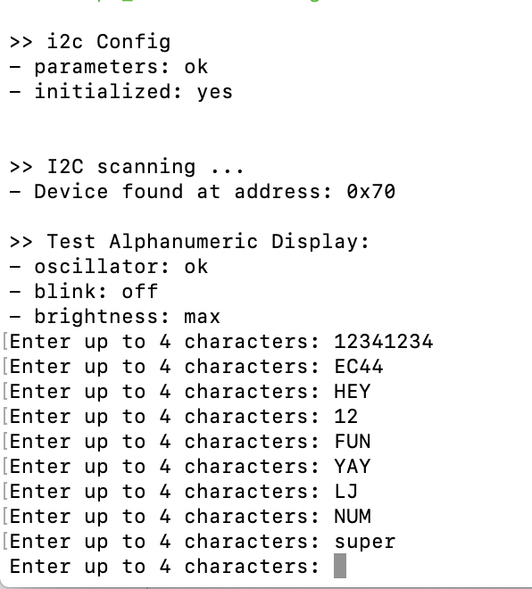

#  Alphanumeric Display

Author: Laura Joy Erb, 2019-09-14

## Summary
I used the Adafruit 14-segment alphanumeric display with the ESP32 to display letters and numbers based on input from the console.

The user can input any characters, numbers, symbols they would like, and the alphanumeric display will display the first four of those characters. Any additional characters will be printed to the console, but not shown on the alphanumeric display.

## Sketches and Photos
The console input attached to the video of the alphanumeric display in action:

Video of the Alphanumeric Display's responses to those inputs:

https://drive.google.com/file/d/1KaADtpvfU-zaa-ayGQ0YQP38VDGtZ93f/view?usp=sharing
