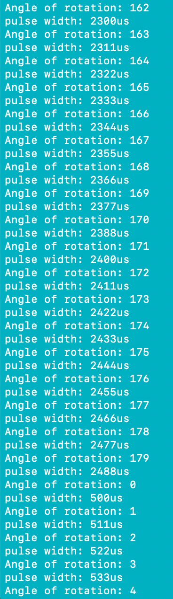

#  Servos

Author: Laura Joy Erb, 2019-09-17

## Summary
I connected the servo to the ESP32. I adjusted the maximum and minimum pulse width in order to adjust how much the servo rotates. I used 2500 maximum pulse width and 500 minimum pulse width. This allowed the servo to rotate a full 180º (its full rotation). The servo rotates 180º, pauses briefly, and then returns to it's initial location to begin rotating the 180º again.

## Sketches and Photos
Here is the console output from the servo rotation. The console shows the servo "wrapping around" from 180º back to 0º. 

Here is the video of the full servo rotation:

https://drive.google.com/file/d/13w_YQAMq7LVGpb8t6fXKXpqbhOl5Vs7Q/view?usp=sharing
