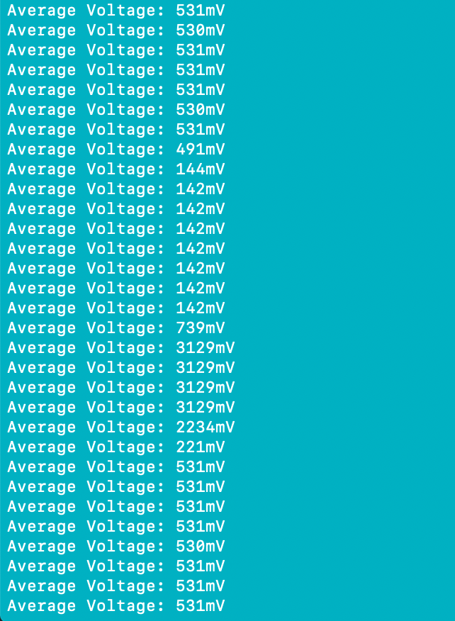
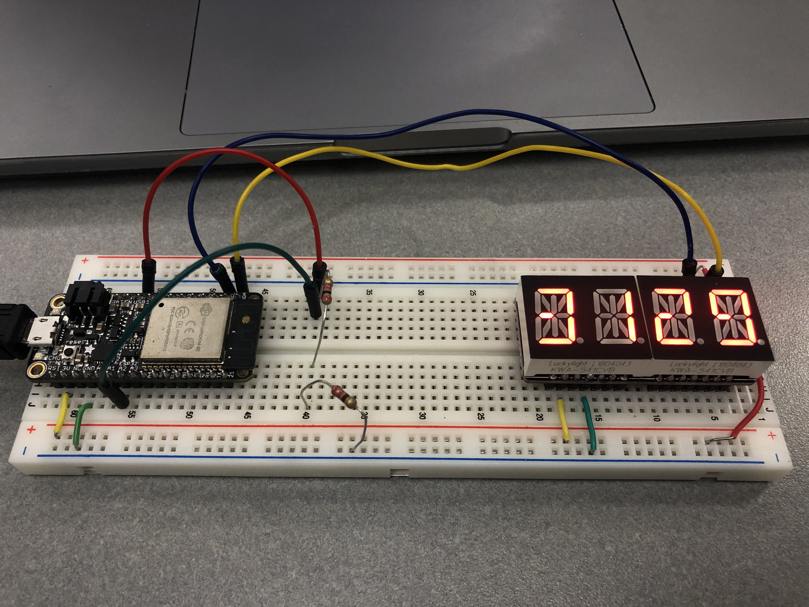

#  Battery Voltage Monitor

Author: Laura Joy Erb, 2019-10-03

## Summary
This skill focused on reading input from the ADC pin of the ESP32 and displaying it on the alphanumeric display. This required using a voltage divider to lower the 5V USB voltage output to a working range of <3.3V for the ADC input pin. 

I used one 10K ohm resistor and one 2K ohm resistor for my voltage divider. This brought the voltage to a range of ~530mV. The value displayed on the alphanumeric display in mV. 

## Sketches and Photos
To test the functionality of the "battery monitor," I plugged the input for the ADC pin into the middle of the voltage divider, then ground, and then the 5V USB input before returning to the voltage divider value. 

This is the console output from this routine. As you can see, the console first prints ~530mV, then prints ~142mV, and finally prints ~3129mV. The ground bottoms out the range of the ADC input, so it shows a value of 142mV. Similarly, the 5V input maxes out the range of the ADC input, so it registers 3128mv instead.

This video shows me moving the wire input to the specified locations. It was difficult to show the console output and the moving of the wire at the same time, so one was captured in a screenshot, and one was captured in this video:

https://drive.google.com/file/d/1VkIS_Tu4MIASx4pgLyXrUuvuvu3MvDHJ/view?usp=sharing

Here are images of the alphanumeric display corresponding to each of the three states:

High Voltage:

Voltage Divider:

Low Voltage (Ground):

