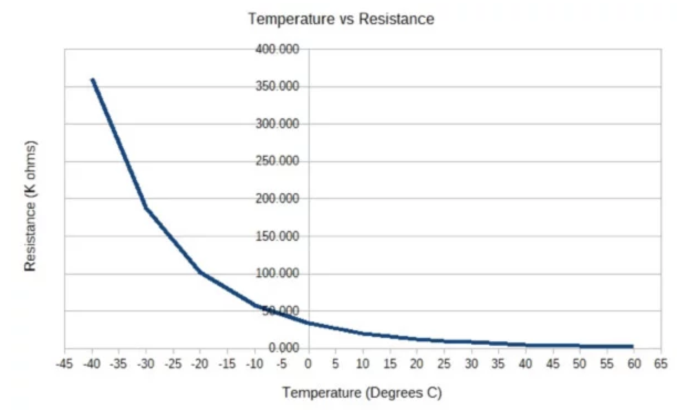
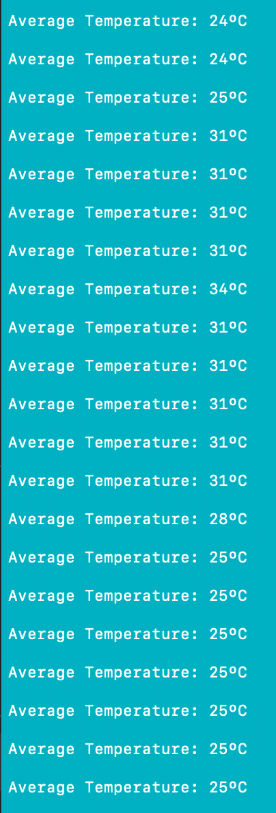

#  Thermistor

Author: Laura Joy Erb, 2019-10-05

## Summary
I read temperature using a thermistor and printed the output to the console. I used a voltage divider between a 2K ohm resistor and the 10K thermistor itself. As the temperature increases, the resistance of the thermistor decreases. I used the voltage at the voltage divider to determine the resistance of the thermistor, and I used that value to calculate the temperature of the ambient environment using the following curve:

## Sketches and Photos
Here is the wiring of the thermistor:

 

And here is the console output from subjecting the thermistor to the ambient room temperature, then heating it with my fingers, and then cooling it back down to ambient:

## Modules, Tools, Source Used in Solution
https://docs.espressif.com/projects/esp-idf/en/latest/api-reference/peripherals/adc.html

Example Code: https://github.com/espressif/esp-idf/tree/39f090a4f1dee4e325f8109d880bf3627034d839/examples/peripherals/adc\

Thermistor Graph: https://www.jameco.com/Jameco/workshop/TechTip/temperature-measurement-ntc-thermistors.html
