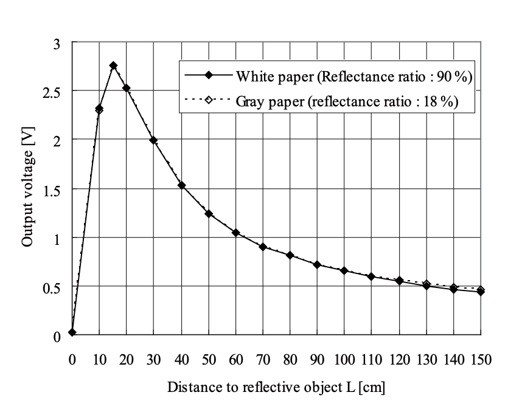

#  Long Range IR Range Sensor

Author: Laura Joy Erb, 2019-10-05

## Summary
I wired up a Sharp Long Range IR sensor to sense distance. I used ADC to read the raw readings from the sensor, and I mapped the raw readings to a corresponding distance value. I used the following graph to map the voltage readings to a distance:

The IR sensor has a range of 20cm-150cm. I sampled the distance every second and printed the distance values to the console. 

## Sketches and Photos
Here is a video of the IR sensor printing distance values to the console:

https://drive.google.com/file/d/1dsP2vy1LYrjjALKIt8FzxZhuGXKbW8z_/view?usp=sharing

## Modules, Tools, Source Used in Solution
https://www.sparkfun.com/datasheets/Sensors/Infrared/gp2y0a02yk_e.pdf
