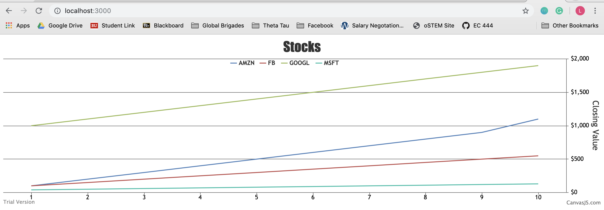

#  CanvasJS

Author: Laura Joy Erb, 2019-10-05

## Summary
This skill used CanvasJS to chart various data sets. First, I setup a few of the example charts from the CanvasJS website. These charts can be found in the example_charts folder of the code.

Then, I set up a chart to display the data from the stocks.csv file. I started by embedding the data within the javascript. Then, I setup socketio to handle reading the data from the file rather than directly embedding the data into the javascript. The chart reads the csv file, parses it into arrays of datapoints, and passes those arrays to the chart to be displayed on the web browser.

## Sketches and Photos

The example charts:

The stocks graph using the data from the .csv file:

## Modules, Tools, Source Used in Solution
https://canvasjs.com/javascript-charts/

https://canvasjs.com/javascript-charts/stacked-column-chart/
