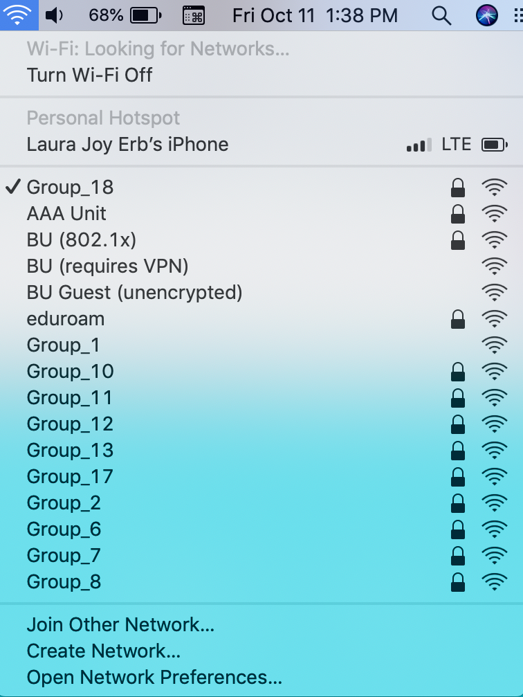

#  Router Config

Author: Laura Joy Erb, 2019-10-21

## Summary
We used our E1200 v2 router to run the Tomato firmware. We wired up the router iwth ethernet and power, reset it, and changed all the settings to the desired configuration. 

Our router provides wifi under the name Group_18.

# Images

Here is a screenshot of my computer connected to the Group_18 wifi:

