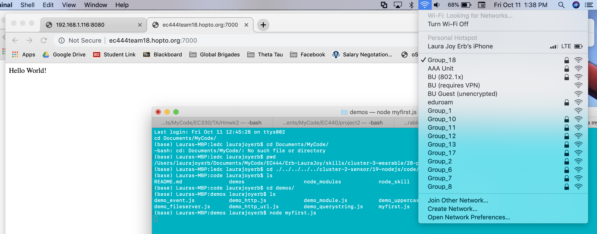

#  Dynamic DNS

Author: Laura Joy Erb, 2019-10-21

## Summary
In this skill I set up the router for DDNS and port forwarding. I used our team wifi and our team hostname to render the Hello World home page node server housed in myfirst.js.

## Sketches and Photos
Here is an screencapture demonstrating the Hello World page, the domain name (ec444team18.hopto.org), the wifi from the router set to Group_18, and finally the node server being run from terminal:

Additionally, here is a video of connecting a device to the group wifi and routing to our Hello World page using the hostname ec444team18.hopto.org/7000.

https://drive.google.com/open?id=1j0TUN2lPJ0EolK8sdvrtYIW61oMNCDOf
