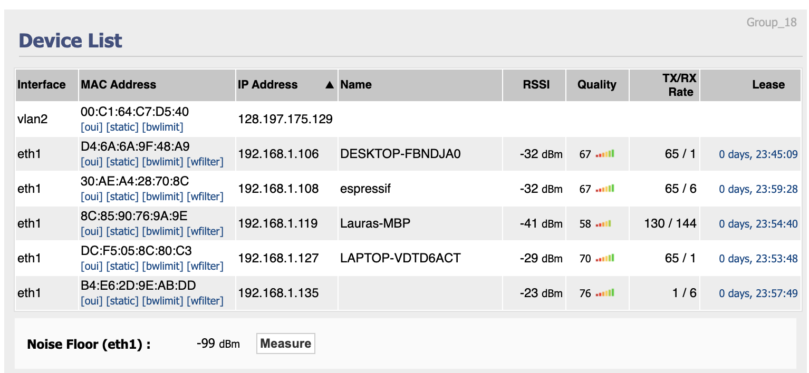
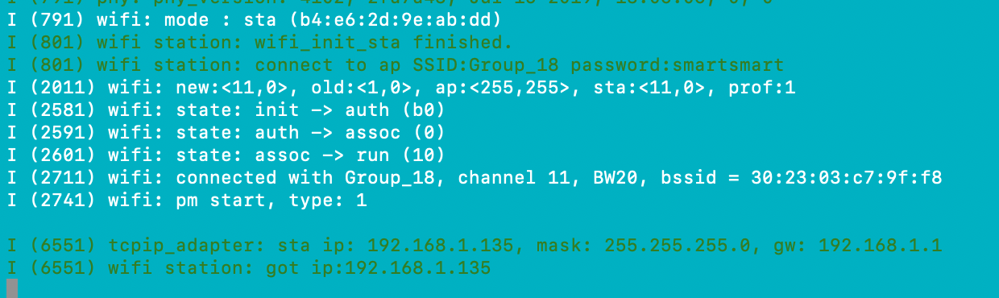

#  WiFi

Author: Laura Joy Erb, 2019-10-21

## Summary
In this skill I connected the ESP32 to our team wifi, Group_18. I used the wifi station example for the ESP32. 

## Sketches and Photos
Here is the list of devices connected to our team wifi, including the ESP32:

And the console output from the ESP32 code:

