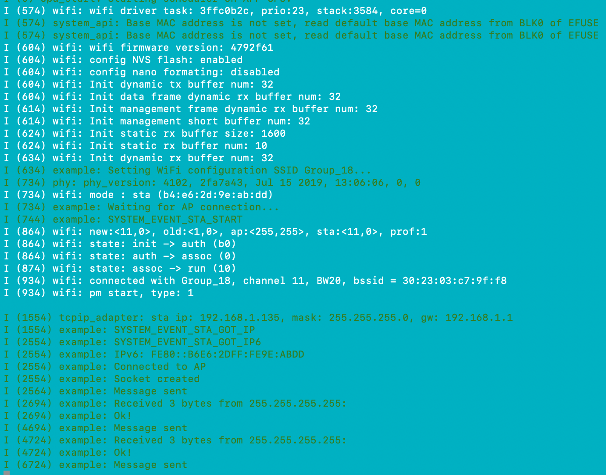

#  IP Chat

Author: Laura Joy Erb, 2019-10-21

## Summary
In this skill, I setup the ESP32 to communicate with my laptop through our team wifi, Group_18. Both devices communicate through port 8080 using UDP sockets. 

## Sketches and Photos
Here is the printout to the console, ie sending and receiving messages:

Here is a video of the ESP32 sending messages to the console via the wifi, and the console receiving the messages:

https://drive.google.com/open?id=1D5_CaVIHfMefmx89f4HVLos9ZAz6HHe1
