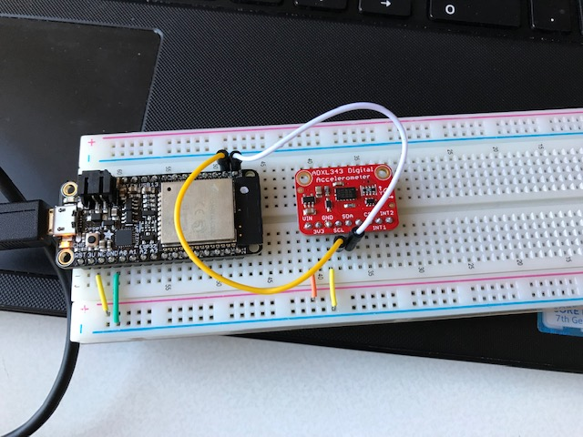

#  Triple-Axis Accelerometer

Author: Laura Joy Erb, 2019-10-21

## Summary
I used the ADXL343 device to measure acceleration in three directions. I used I2C to communicate between the device and the ESP32, and I implemented functions to read and write to registers to get the acceleration data from the device. 

I used formulas to calculate roll and pitch from the acceleration values. 

## Sketches and Photos
Here is how the accelerometer was wired up with the ESP32:

Here is a video of the accelerometer displaying values for acceleration in three axes as well as the roll and pitch (tilt data) of the device:

https://drive.google.com/open?id=1PrEiZQyTcmDv-47O0pErdgyT1LddP_m5
