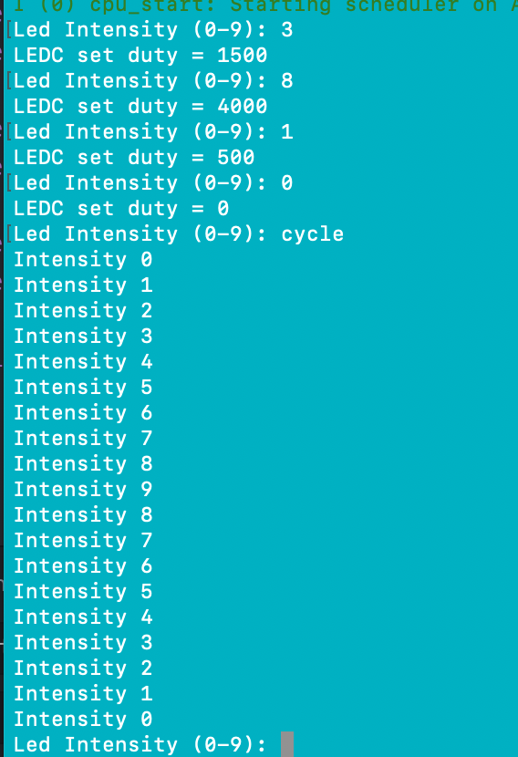

#  PWM-Controlled LED

Author: Laura Joy Erb, 2019-10-21

## Summary
By adjusting the duty cycle of the input power to the LED, we can adjust the brightness of the bulb. I used this to create a simple program to control the brightness of the LED from user input. 

A user can input numbers 0-9 into the console to see the various "intensity levels" of brightness for the LEDs. If the user types "cycle" instead of one of the numbers, the LED will cycle through the levels of intensity, starting at zero, going discretely to 9, and returning back to zero before prompting the user for an intensity level again. 

## Sketches and Photos
Here is the console side of the program, including user input and program output:

Here is a video of the LED ranging through intensity levels based on user input to the console:

https://drive.google.com/open?id=1gwgnjbe8cjzrtonk4ToM8FLyq2ZAfj-6
