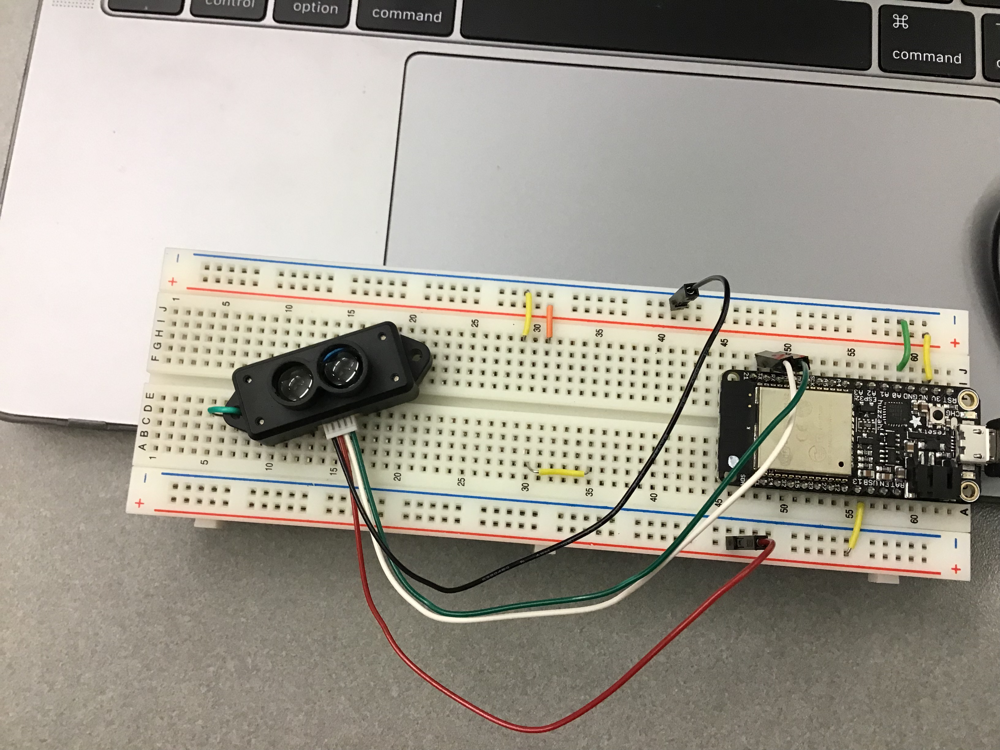

#  MicroLIDAR

Author: Laura Joy Erb, 2019-11-05

## Summary
In this skill, we wired up the microLIDAR to read distances and print to the console. This required setting up UART communication using UART1. The microLIDAR has a continuous stream of data in 9 byte packets, so we had to align our readings to ensure we were reading the right bytes for distance. The 9 bytes of data have the first two as headers, marked by 0x59. We read 12 bytes at a time (the largest possible number of bytes necessary to ensure that we will get the two distance bytes, byte 2 and 3) and scanned the bytes for the 0x59 headers. After finding the headers, we grabbed the distance bytes, concatenated them, and coverted them to distance units in meters. These values are printed to the console. 

## Sketches and Photos
This is the wiring of the microlidar:

Here is a video of the console output from the microLIDAR. My apologies for not being able to see my hand above the sensor, but for reference, I moved my hand slowly upwards to demonstrate the increasing distances on the console.

https://drive.google.com/open?id=1uhXGE-XQeOTmBhxBIcG1alsa3me0w_JM
