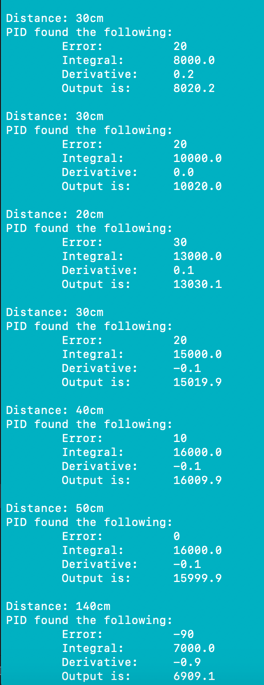
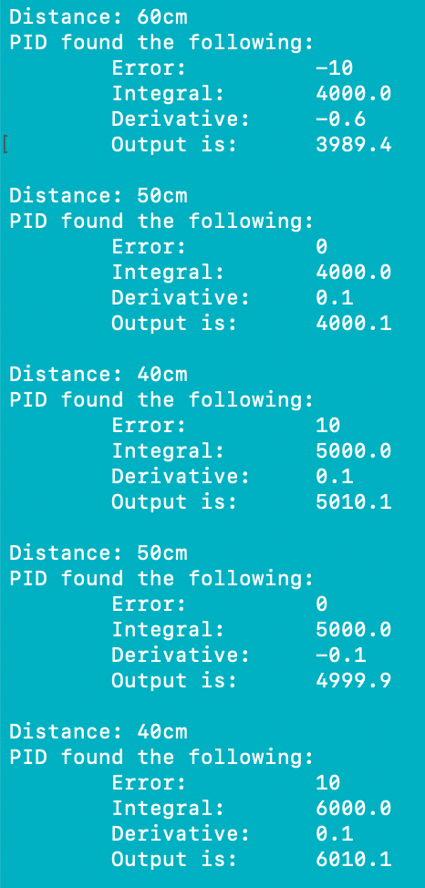

#  PID

Author: Laura Joy Erb, 2019-11-05

## Summary
In this skill, we implemented the basics of PID control using the IR sensor and LEDs.

We wired up the sensor and printed distance values to the console. We also implemented a PID function that reads the "error" from an arbitrary setpoint. We chose 50cm as our setpoint. Every cycle, dt, the PID function calculated the error, integral and derivative. We chose 25 as our dt.

When the error is greater than 0, or the distance is greater than 50cm, the red led on our board lights up. When the error is less than 0, or the blue led lights up. If the distance is exactly 50cm, the green leds lights up. These are all determined by the error calculated in the PID function.

## Sketches and Photos

Here is the wiring of the PID circuit with the LEDs:

And here is an example console output from the PID function:

 

Here is a video of the PID lighting up the corresponding LEDs as the distance changes:
https://drive.google.com/open?id=1zCgNyXTRcczX409S5Wsfz2q6FFbJQene
