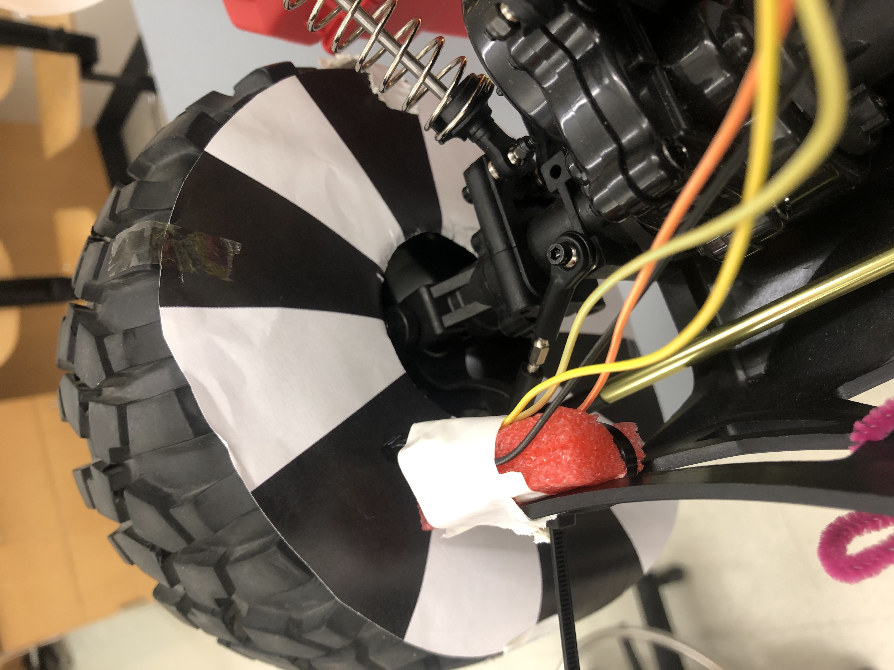
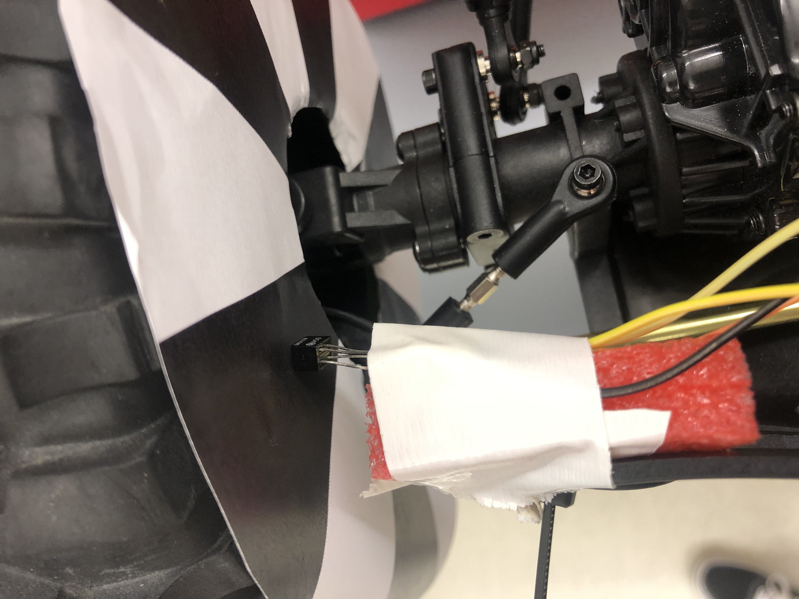

#  Wheel and Car Speed Sensor

Author: Laura Joy Erb, 2019-11-05

## Summary
This skill uses the optical encoder to determine wheel speed on the crawler. The optical encoder can detect differences in reflective surfaces such as the white and black wheel we used for wheel speed detection. As the wheel spins and the color wheel rotates, the optical encoder reflects against white and black alternating sectors. The optical encoder produces a voltage pulse as it switches between the white and black sectors. We counted this pulse and used the frequency of the pulse to determine wheel speed.

## Sketches and Photos
Here is how the optical encoder is hooked up to the wheel of the crawler:

And here is a video of the wheel speed printing to the console as well as the crawler moving with the optical encoder reading the speed:
https://drive.google.com/open?id=1Wvm0s8Lbrm5edeYBUS-zeCr3fHQM4m3C
