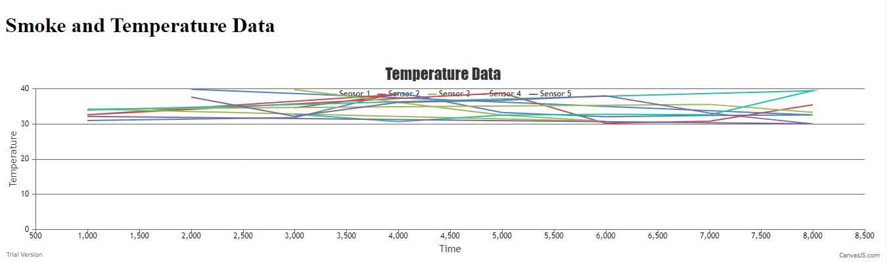
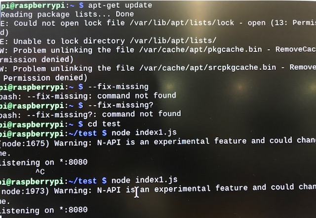

#  Persistence and Databases

Author: Laura Joy Erb, 2019-11-19

## Summary
For this skill, we got the Level database up and running on the raspberry pi. We read sample data and stored it in the database. We displayed this data on a graph by using the raspberry pi to house the database. 

## Sketches and Photos

