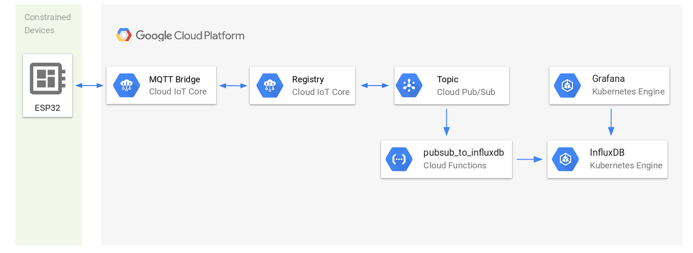

#  38 - Security

Author: Laura Joy Erb, 2019-11-20

## Summary

The Bad Guy (BG) can take control over many of the components of the system. The BG can take control over the ESP to falsify data, can take control over the communication between the ESP and the server, or can take control of the server itself. Access to any of these points could be potentially very dangerous to the Good Guy (GG). 

### Identify weaknesses in your node.js to ESP32 system for quest 3 (wearable)

Our website has no login or SSO to confirm the identity of whomever is accessing our website. It is open to anyone with an internet connection.

Beacuse of this, all our functions are open to not only the user wearing the device but also to all people accessing the website. Our user might get unwanted water alerts set by strangers.

Among all users connected to our website, we cannot identify which connection is our user. Even when the user wants to see all charts showing on the site, someone else might set a chart invisible. Thus we have no protection on user's personal information. All data is accessible to whoever connects to the website.

### What ways can a bad guy attack your specific system? List at least three

- A bad guy might set water alert every 5s on HTML
- A bad guy might set all charts invisible even when the user wants to see the data
- A bad guy might use the data for statistics without asking permission
- A bad guy might physically attack our vulnerable sensors and wires

### Describe ways that you can overcome these attacks. What ways can you mitigate these issues?

The most obvious way to mitigate these attacks is to verify the identity of the user using a login and user authorization. Only an authenticated user should be able to see charts, hide charts, and set water alerts for their own device.

### “IoT” provisioning is a specific challenge for connected devices. Describe how the ESP32 code base provides an IoT provisioning solution. This is the process of associating an ESP32 with a particular user and authentication in a local network.

To have user authentication, we can connect ESP32 to Google Cloud IoT Core so as to quickly and securely connect large fleets of devices directly to the Google Cloud. Cloud IoT Core is composed of two main components, a device manager and a protocol bridge:
- The device manager helps to establish the identity of a device and provides the mechanism for authenticating a device when connecting. It also maintains a logical configuration of each device and can be used to control any device from the cloud remotely.
- The protocol bridge is the way for the device to access the Google Cloud through standard protocols such as MQTT and HTTP, so one can use your existing devices with minimal firmware changes.

The data from Pub/Sub is stored in a time-series database (InfluxDB) located in a GKE cluster.

## Modules, Tools, Source Used in Solution

[ESP32 Arduino: Basic Authentication](https://techtutorialsx.com/2018/01/03/esp32-arduino-basic-authentication/)

[Using Cloud IoT Core to connect ESP32](http://nilhcem.com/iot/cloud-iot-core-with-the-esp32-and-arduino)
