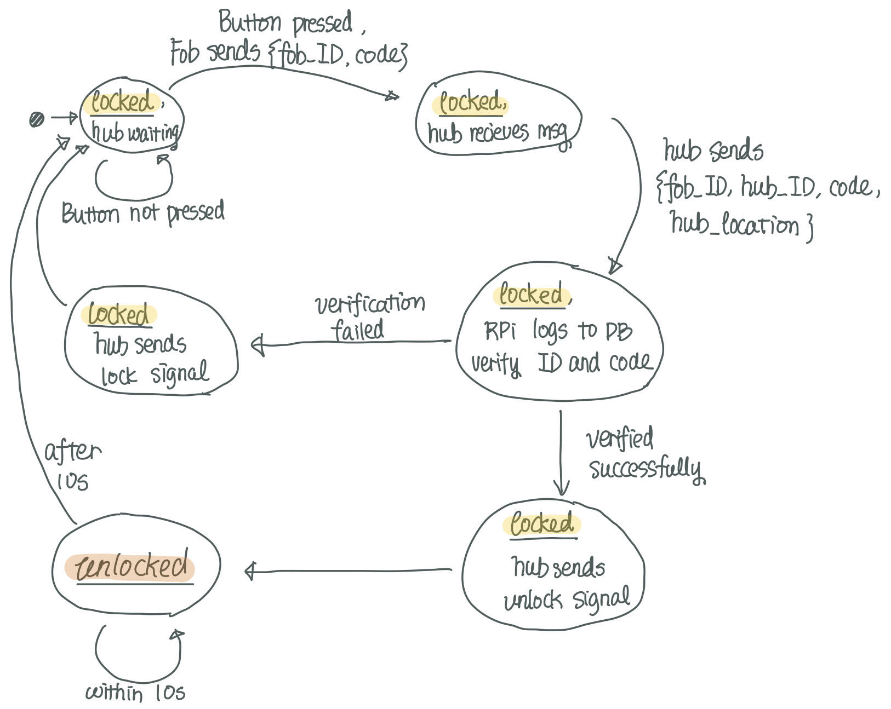
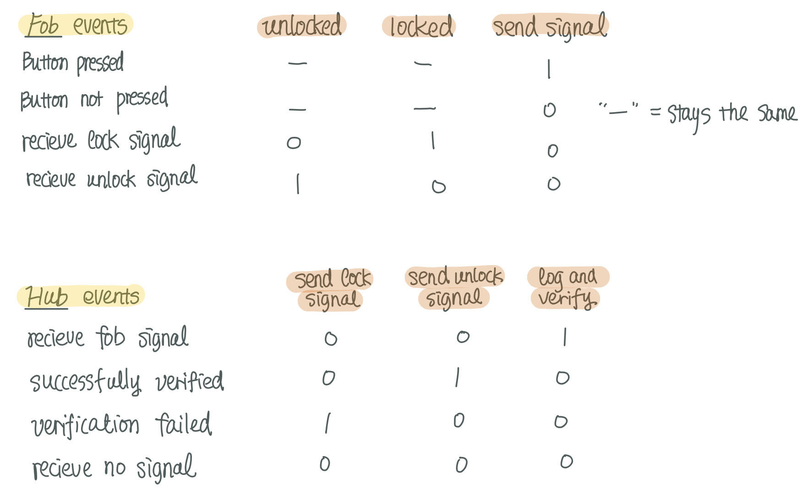

#  40 - State Models

Author: Laura Joy Erb, 2019-11-20

## Summary

In this skill, we build the state diagram and state tables for the secure key quest. 

## Sketches and Photos

### Data flow
Assume location message sent by hub. 

  

### State Diagram

  

### State Table

  
