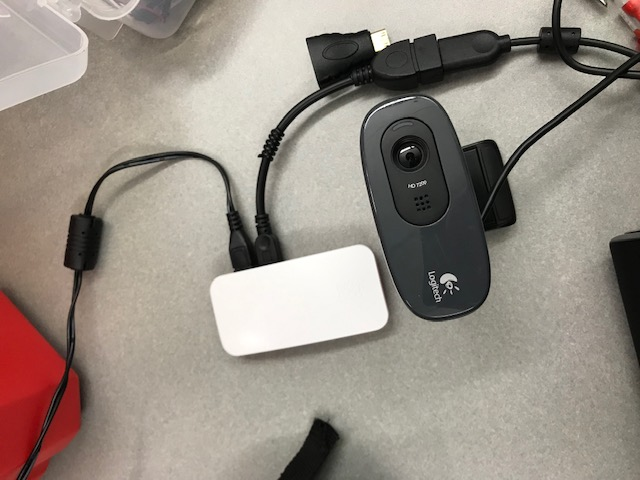

#  Using the USB Webcam on the Raspberry Pi Zero

Author: Yuting Chen, Erin Dorsey, Laura Joy Erb, 2019-12-03

## Summary
Used Motion package to build a webcam module for the RPi. Module is diplayed at 192.168.1.109:8081 on a computer monitor. 

## Sketches and Photos

- [Link to video](https://drive.google.com/open?id=1xYDnso2isYIKjuKTsIuNgqyAWy5alLjV)

## Modules, Tools, Source Used in Solution

## Supporting Artifacts

-----

## Reminders
- Repo is private
